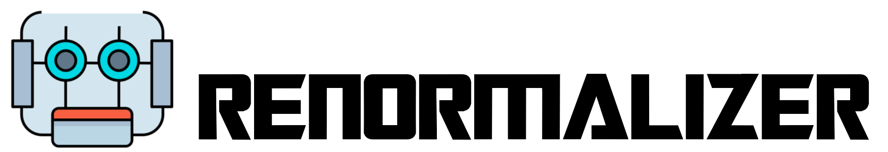

[](https://app.circleci.com/pipelines/github/shuaigroup/Renormalizer)
[](https://codecov.io/gh/shuaigroup/Renormalizer)

Renormalizer is a python package based on tensor network states for electron-phonon quantum dynamics.

## Installation
```
pip install renormalizer
```

For users who are not familiar with python, step-by-step installation guide can be found in the [document](https://github.com/shuaigroup/Renormalizer/wiki/Installation-guide).

## Documentation
Primitive documentation could be found [here](https://shuaigroup.github.io/Renormalizer/).

## Notice
* Renormalizer is still under heavy development. Drastic API changes come without any prior deprecation.